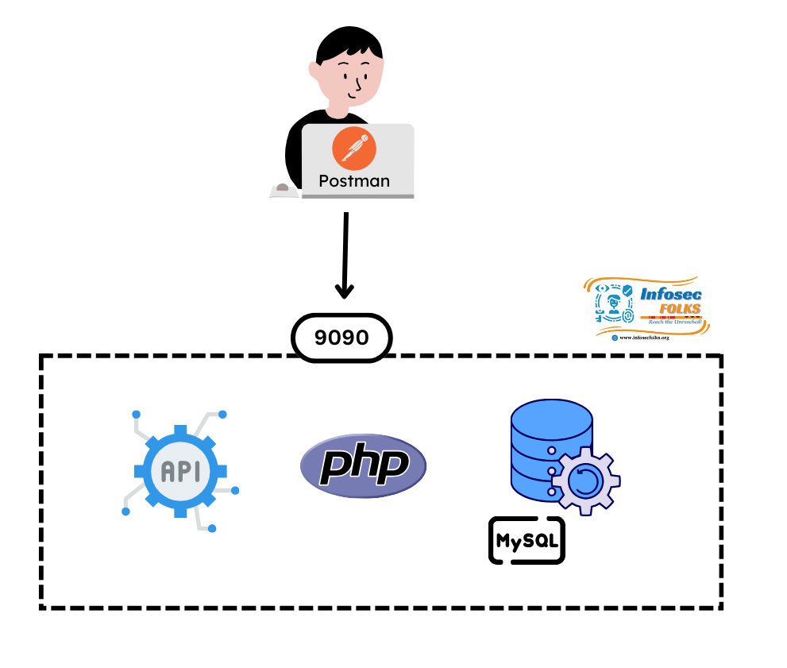

# Vulnerable_collegeportal_api
This vulnerable college portal API is built in a Docker environment using API Layer, PHP, MySQL technologies, and Restful API's. It is intended solely for educational purposes to learn and practice API penetration testing. Do not attempt these techniques on real-world applications without proper consent from the application owners. Since this vulnerable API, do not host it in any product environment or publicly.

Default username & password 
----------------------------
username - ravi ;
password - hod@123 ;
role - HOD (Head of the department)

username - krishna ;
password - abc123 ;
role - Student

Follow the below steps to deploy it as docker in your machine.

> [!TIP]
> We recommend using Kali Linux as your base OS for running these Docker containers, as it comes pre-installed with the essential tools for learning penetration testing! 

## Steps to Install and enable docker

> [!NOTE]
> If you don't have docker installted in your machine you can follow this below steps, otherwise skip to Building and running docker containers

Update kali repository   
**#sudo apt-get update**

Installing docker   
**#sudo apt-get install -y docker.io**

Start and enable docker service  
**#sudo systemctl start docker   
#sudo systemctl enable docker**

Check docker version   
**#docker --version**

Download the latest Docker Compose binary  
**#sudo curl -L "https://github.com/docker/compose/releases/latest/download/docker-compose-$(uname -s)-$(uname -m)" -o /usr/local/bin/docker-compose**

Apply executable permissions  
**#sudo chmod +x /usr/local/bin/docker-compose**

Verify the installation  
**#docker-compose --version**

> [!NOTE]
> If you have docker and docker-compose, already skip the above steps and follow this below steps

## Steps to run vulnerable collegeportal API as docker container 

After installing docker, now navigate to the cloned directory which is "vulnerable_collegeportal_api" and execute following docker commands 
to deploy and launch vulnerable college portal API   

This command build and run both the containers and intialize database - One single command makes everything setup in background and api will be available on 9090 port for testing   
**#docker-compose up --build -d**

Follow us for more updates   
[INFOSEC FOLKS - LINKEDIN](https://www.linkedin.com/company/infosecfolks-global/)   

[INFOSEC FOLKS - YOUTUBE](https://www.youtube.com/@infosecfolks-global/)  
[INFOSEC FOLKS Telugu - YOUTUBE](https://www.youtube.com/@InfosecFolks-Telugu/)  

